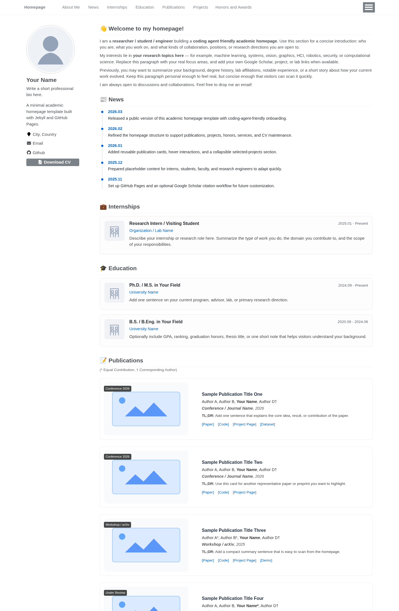

<h1 align="center">
Amber-Homepage
</h1>

<div align="center">

A coding agent friendly academic homepage template based on [RayeRen/acad-homepage.github.io](https://github.com/RayeRen/acad-homepage.github.io).

</div>

<p align="center">
  
</p>

## What this repo is

This repository is a **public academic homepage template** extracted and cleaned up from a heavily customized private personal site.

It keeps the homepage structure, visual interactions, collapsible project folder, sidebar CV button, publication cards, and academic-page layout patterns, while removing personal-only content and private assets.

## Reference links

- Personal production site: https://amberheart.github.io/
- Original public homepage base repo: https://github.com/RayeRen/acad-homepage.github.io
- Coding-agent handoff guide: `docs/agent-setup.md`

## What you get

- Single-page academic homepage with anchored navigation
- Sidebar profile with social links and a downloadable CV button
- News timeline, internships, education, publications, projects, honors, and services sections
- Hoverable paper/project cards and collapsible selected-projects folder
- Optional Google Scholar citation workflow
- GitHub Pages deployment workflow for forks
- Public-safe placeholder content that is ready to replace

## Quick start

1. Fork this repository.
2. Decide whether your site will be:
   - a **user site**: rename the fork to `USERNAME.github.io`
   - a **project site**: keep the repo name and set `url` / `baseurl` in `_config.yml`
3. Replace the placeholder identity fields in `_config.yml`.
4. Replace the placeholder homepage content in `_pages/about.md`.
5. Replace placeholder assets in `images/` and `CV/`.
6. Run the site locally and confirm the build.
7. Enable GitHub Pages in **your own fork**, then push to `main`.

## Required fields to fill

These are the minimum fields most users should update before publishing.

### `_config.yml`

At minimum, review these keys:

- `title`
- `description`
- `repository`
- `url`
- `baseurl`
- `author.name`
- `author.avatar`
- `author.bio`
- `author.location`
- `author.email`
- `author.github`
- `author.linkedin` (optional)
- `author.googlescholar` (optional)
- `author.cv`

Default behavior:

- `author.cv` is already set to `CV/CV.pdf`
- the repo includes a placeholder `CV/CV.pdf`
- replace that file with your own exported CV when ready

### `_pages/about.md`

This file controls the visible homepage content. The template already includes the full section structure.

Replace the placeholder text in these sections:

- About Me
- News
- Internships
- Education
- Publications
- Projects
- Honors and Awards
- Services

If you do not need a section, remove or simplify it — but the default structure is designed to match a modern academic homepage layout.

### `images/`

You will likely want to replace:

- avatar image
- organization / school logos
- publication thumbnails
- project thumbnails

### `CV/`

The template ships with:

- `CV/CV.tex` — placeholder LaTeX skeleton
- `CV/CV.pdf` — placeholder downloadable PDF

Replace either or both with your own materials.

## Local development

Install dependencies and run locally:

```bash
bundle install
bash run_server.sh
```

Then open:

```text
http://127.0.0.1:4000
```

To run a production-style build check:

```bash
bundle exec jekyll build
```

The generated static site will be written to `_site/`.

## Deployment

### For a fork that should auto-deploy on push

1. Fork this repository.
2. In your fork, enable **GitHub Pages** and select **GitHub Actions** as the build source.
3. Push changes to `main`.
4. The deployment workflow will run automatically in your fork.

### User site vs project site

#### User site

Use this when your repository name is `USERNAME.github.io`.

Typical config:

```yaml
url: "https://USERNAME.github.io"
baseurl: ""
```

#### Project site

Use this when your repository name is something like `my-homepage`.

Typical config:

```yaml
url: "https://USERNAME.github.io"
baseurl: "/my-homepage"
```

If your images, CV link, or static assets load incorrectly after deployment, check `url` and `baseurl` first.

## Google Scholar workflow

This repository includes an optional citation workflow.

If you want automatic citation data updates:

1. Find your Google Scholar user ID.
2. Add `GOOGLE_SCHOLAR_ID` to your fork's GitHub Actions secrets.
3. Push changes or run the workflow manually.

If the secret is missing, the workflow exits successfully without crawling.

## Notes for coding agents

If you want a coding agent to customize the site for you, start with:

- `docs/agent-setup.md`
- `_config.yml`
- `_pages/about.md`

The template is structured so an agent can replace identity, content, assets, and deployment settings without needing access to any private source repository.

## Reuse and attribution

This template supports heavy customization and remixing, but please keep the relevant upstream attribution when redistributing substantial portions.

- Homepage base: [RayeRen/acad-homepage.github.io](https://github.com/RayeRen/acad-homepage.github.io)
- CV lineage: Jake Gutierrez's "Jake's Resume"

## License

MIT. See `LICENSE`.
